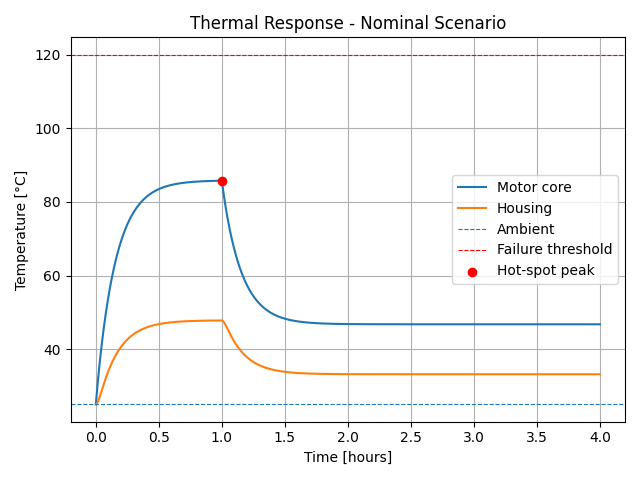

# Universal Thermal Digital Twin

A multi-node, physics-based **thermal digital twin engine** built in
Python to model heat generation, conduction, and convection across
mechanical and electromechanical systems. This project supports
**predictive thermal failure analysis, hot-spot detection, and
parametric sensitivity studies** for reliability-driven design.

------------------------------------------------------------------------

## 🚀 Features

-   Multi-node lumped thermal network\
-   Time-step numerical integration (explicit Euler)\
-   Internal heat generation modeling\
-   Convection to ambient and conduction between components\
-   Overload → steady-state → cooldown behavior\
-   **Hot-spot detection with thermal margin to failure**\
-   **Parametric sensitivity analysis**:
    -   Load vs peak temperature\
    -   Cooling efficiency vs peak temperature\
    -   Ambient temperature vs peak temperature\
-   **Overload duration study** for reliability risk assessment\
-   Automated engineering plots with matplotlib

------------------------------------------------------------------------

## 🧠 Engineering Use Cases

-   Motor thermal analysis\
-   Power electronics enclosure cooling\
-   Battery module thermal studies\
-   Industrial equipment overheating risk\
-   Predictive maintenance and digital twin modeling

------------------------------------------------------------------------

## ⚙️ How It Works

Each component is modeled as a **lumped thermal mass** with:

-   Thermal capacitance (J/K)\
-   Internal heat generation (W)\
-   Convection to ambient (W/K)\
-   Conduction paths between nodes (W/K)

The solver performs explicit time-stepping to compute transient thermal
behavior and automatically identifies **hot-spot temperatures and
thermal safety margin**.

------------------------------------------------------------------------

## 📊 Results

### Nominal Motor Thermal Response



------------------------------------------------------------------------

## 🛠 Running the Project

### Install requirements:

``` bash
pip install matplotlib
```

### Run the simulation:

``` bash
python thermal_digital_twin.py
```

All results will print to the console and generate plots automatically.

------------------------------------------------------------------------

## 🔬 Technical Stack

-   Python 3\
-   Numerical simulation (explicit Euler)\
-   Object-oriented thermal modeling\
-   Matplotlib for visualization

------------------------------------------------------------------------

## 👤 Author

**Yengkong V. Sayaovong**\
Industrial Systems & Reliability Engineer\
Mechanical Design • Software • Data • Automation
